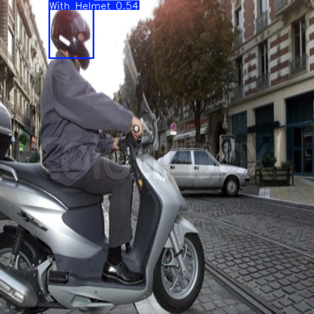

# Safety Helmet Detection using YOLOv8

## Problem
Construction site safety often relies on manual checks to ensure workers wear helmets. 
This project automates helmet detection using computer vision, helping identify workers 
who may not be following safety protocols.

## Live Demo
🔗 [Try the app here](https://safety-helmet-detection-hd3qqhupykur89ish2xzkj.streamlit.app/)

## Approach
- Used YOLOv8 (Ultralytics), a fast, real-time object detection model.
- Fine-tuned a pretrained YOLOv8n model on a labeled dataset of ~1,737 images sourced from [Roboflow](https://universe.roboflow.com/learning-evidence/helmet-detection_yolov8).
- Two classes: "With Helmet" and "Without Helmet".
- Trained in Google Colab using a free T4 GPU, over 50 epochs.
- Built an interactive Streamlit web app with a sidebar showing model stats and usage instructions.
- Deployed permanently on Streamlit Community Cloud.

## Results

| Metric | With Helmet | Without Helmet |
|---|---|---|
| Precision | 88.3% | 85.6% |
| Recall | 90.5% | 79.8% |
| mAP50 | 95.4% | 87.7% |

**Overall mAP50: 91.6%** | **mAP50-95: 58.8%**

## Demo
Upload any image and the app detects and labels each worker as "With Helmet" or "Without Helmet".

## How to Run Locally
1. Clone this repository
2. Install dependencies: `pip install -r requirements.txt`
3. Run the app: `streamlit run app.py`

## Tech Stack
Python · YOLOv8 (Ultralytics) · Roboflow · Streamlit · Google Colab · Streamlit Community Cloud

## Future Improvements
- Improve recall for the "Without Helmet" class (currently 79.8%), the most safety-critical case to catch, using more training data or additional epochs.
- Add real-time video stream detection support.
- Address the class imbalance seen in per-class recall through targeted data augmentation.
